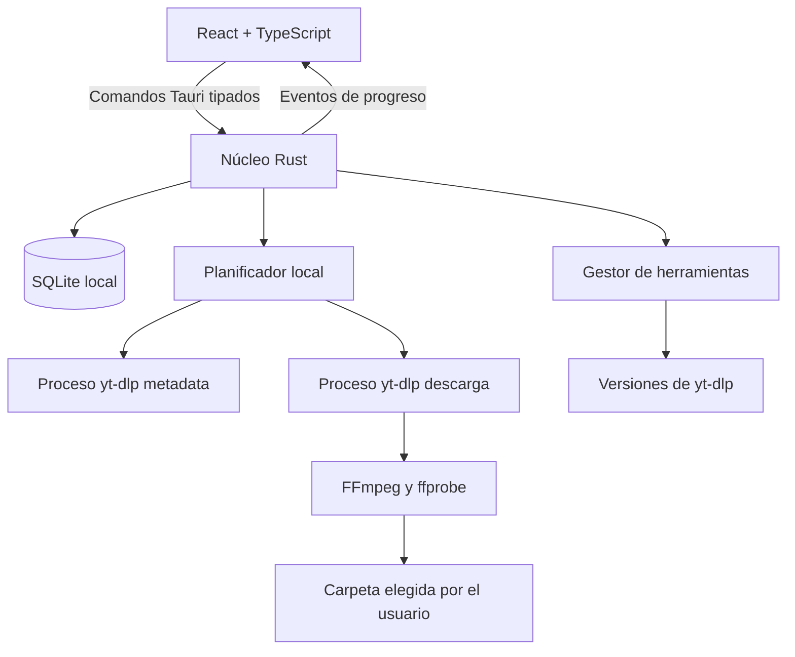

# Plan de desarrollo — YouTube Playlist → MP3 para Windows

## 1. Visión del producto

Construir una aplicación de escritorio local-first para Windows 10/11 x64 que permita descargar playlists de YouTube y YouTube Music de hasta unas 5000 canciones.

Cada usuario instala y ejecuta la aplicación en su propio equipo. Las conexiones a YouTube, la conversión, la base de datos y los archivos permanecen en esa máquina. No existe un servidor central ni se comparten trabajos entre usuarios.

La aplicación debe permitir:

- Importar playlists de YouTube y YouTube Music.
- Descargar audio en MP3 a 192 kbps.
- Procesar varias playlists mediante una cola global con concurrencia limitada.
- Pausar, continuar, cancelar, reintentar y cambiar la prioridad de los trabajos.
- Recuperarse después de cerrar la aplicación o reiniciar Windows.
- Sincronizar una playlist y descargar solo sus canciones nuevas.
- Elegir una carpeta predeterminada y cambiarla por trabajo.
- Organizar los archivos en una carpeta por playlist de forma predeterminada.
- Escribir metadata y portada en los MP3.
- Generar un archivo M3U con el orden de reproducción.
- Distribuirse como instalador y como paquete portable.
- Mantener `yt-dlp` actualizado y restaurar una versión anterior si falla.
- Funcionar sin cuentas, telemetría ni infraestructura externa propia.

> La aplicación debe utilizarse únicamente para contenido que el usuario tenga derecho a descargar y respetando la legislación y condiciones aplicables.

---

## 2. Decisiones técnicas

### Stack

- **Aplicación de escritorio:** Tauri 2.
- **Interfaz:** React + TypeScript + Vite.
- **Backend local:** Rust ejecutado dentro del proceso Tauri.
- **Runtime asíncrono:** Tokio.
- **Base de datos:** SQLite embebido mediante una biblioteca Rust.
- **Acceso a datos y migraciones:** SQLx con SQLite.
- **Extracción y descarga:** ejecutable `yt-dlp` administrado como sidecar.
- **Conversión y validación:** `ffmpeg` y `ffprobe` administrados como sidecars.
- **Estado de interfaz:** consultas iniciales mediante comandos Tauri y cambios en tiempo real mediante eventos Tauri.
- **Empaquetado inicial:** Windows x64, instalador y ZIP portable.

No se utilizarán FastAPI, PostgreSQL, Redis, Celery, Docker, WebSockets ni almacenamiento remoto para ejecutar la aplicación final.

Docker podrá utilizarse en CI o para herramientas auxiliares, pero un usuario nunca deberá instalar Docker, Python, SQLite, yt-dlp ni FFmpeg manualmente.

### Por qué Tauri desde el inicio

El producto es una aplicación local, no una interfaz para un servicio central. Tauri permite:

- Seleccionar carpetas y escribir directamente en ellas.
- Ejecutar yt-dlp y FFmpeg de forma controlada.
- Distribuir el consumo de red, CPU y disco entre los equipos de los usuarios.
- Evitar autenticación, hosting, almacenamiento temporal remoto y entrega HTTP de archivos.
- Mantener una interfaz web moderna sin ejecutar un servidor local accesible desde la red.

### Por qué Rust y no un backend Python embebido

No se incluirá un runtime Python adicional. Rust coordinará la cola, SQLite, procesos, archivos y eventos. yt-dlp se consumirá como ejecutable autónomo.

Esto reduce el tamaño, las dependencias y los fallos de empaquetado. También evita exponer un servidor HTTP local innecesario.

---

## 3. Arquitectura



### Límites entre capas

| Capa | Responsabilidad |
|---|---|
| UI | Presentar estado y recoger acciones; no ejecutar procesos ni escribir en SQLite |
| Aplicación | Casos de uso: importar, sincronizar, pausar, reintentar y configurar |
| Dominio | Estados, transiciones, prioridades, políticas de colisión y reintentos |
| Planificador | Elegir tareas, aplicar concurrencia y controlar procesos activos |
| Persistencia | Guardar trabajos, playlists, canciones, ajustes y eventos en SQLite |
| Herramientas | Localizar, verificar, actualizar y ejecutar yt-dlp/FFmpeg |
| Archivos | Resolver rutas, nombres, temporales, validación, M3U y limpieza |

La interfaz nunca recibirá una capacidad genérica para ejecutar comandos. Solo podrá invocar comandos Tauri definidos explícitamente.

---

## 4. Estructura propuesta

```text
src/                         # React + TypeScript
  app/
  components/
  features/
    dashboard/
    playlists/
    jobs/
    settings/
    updates/
  lib/
    tauri/
    formatting/
  types/
src-tauri/
  src/
    application/             # Casos de uso
    commands/                # Superficie permitida a la UI
    domain/                  # Entidades, estados y reglas
    persistence/             # Repositorios SQLite
    scheduler/               # Cola, prioridades y concurrencia
    processes/               # Ejecución y cancelación de sidecars
    youtube/                 # Adaptador de yt-dlp
    audio/                   # FFmpeg, ffprobe y etiquetas
    filesystem/              # Rutas, nombres, temporales y M3U
    tools/                   # Instalación, actualización y rollback
    events/                  # Eventos tipados para React
    settings/
  migrations/
  binaries/                  # Sidecars incluidos por target; no versiones descargadas
  capabilities/              # Permisos mínimos de Tauri
  tauri.conf.json
scripts/
  download-sidecars.*
  verify-sidecars.*
  package-portable.*
```

Los binarios descargados o actualizados durante la ejecución se guardarán en el directorio de datos de la aplicación, no dentro de los recursos de solo lectura del instalador.

---

## 5. Datos locales

### SQLite embebido

El usuario no necesita instalar SQLite. La aplicación enlaza la biblioteca necesaria y crea automáticamente un archivo local, por ejemplo:

```text
%LOCALAPPDATA%\YT Playlist Downloader\data\app.db
```

Se habilitarán:

- Foreign keys.
- Modo WAL.
- Busy timeout.
- Migraciones versionadas.
- Transacciones breves.

Solo el backend Rust podrá abrir la base de datos. React no ejecutará SQL directamente.

### Instancia única

La aplicación impedirá abrir dos instancias utilizando el mismo directorio de datos. Si el usuario vuelve a ejecutarla, se enfocará la ventana existente y se podrán reenviar argumentos como URLs.

### Modelo principal

#### `playlists`

- `id` UUID.
- `youtube_playlist_id` único.
- `source_url` normalizada.
- `source_kind`: `youtube | youtube_music`.
- `title`.
- `channel`.
- `thumbnail_url`.
- `default_output_directory` nullable.
- `last_synced_at`.
- `created_at`, `updated_at`.

#### `tracks`

- `id` UUID.
- `youtube_video_id` único.
- `source_url` canónica.
- `title`.
- `artist`.
- `channel`.
- `published_at` nullable.
- `duration_seconds` nullable.
- `thumbnail_url`.
- `availability`.
- `metadata` JSON para datos no esenciales.
- `created_at`, `updated_at`.

#### `playlist_tracks`

- `playlist_id`.
- `track_id`.
- `position`.
- `title_at_sync`.
- `discovered_at`.
- `removed_at` nullable.

Un video puede aparecer varias veces en una playlist. La identidad de una entrada debe incluir la posición o un identificador de entrada estable cuando esté disponible.

#### `jobs`

Una importación, descarga o sincronización solicitada por el usuario.

- `id` UUID.
- `playlist_id` nullable mientras se extrae metadata.
- `kind`: `import | sync | retry`.
- `status`.
- `priority`.
- `source_url`.
- `output_directory`.
- `organization_mode`: inicialmente `playlist_folder | flat`.
- `format_profile`: inicialmente `mp3_192`.
- `existing_file_policy`: `ask | reuse | overwrite | rename`.
- `cancel_requested_at`.
- `created_at`, `started_at`, `completed_at`.

#### `job_items`

- `id` UUID.
- `job_id`.
- `track_id` nullable durante la extracción.
- `playlist_position`.
- `status`.
- `priority_offset`.
- `progress_percent` nullable.
- `downloaded_bytes` nullable.
- `estimated_total_bytes` nullable.
- `attempts`.
- `next_attempt_at` nullable.
- `temporary_path` nullable.
- `output_path` nullable.
- `error_code` nullable.
- `error_message` nullable y sanitizado.
- `created_at`, `started_at`, `completed_at`.

#### `local_files`

Catálogo de resultados conocidos; no significa que el archivo siga existiendo.

- `id` UUID.
- `track_id`.
- `format_profile`.
- `path`.
- `size_bytes`.
- `modified_at`.
- `validation_status`.
- `validated_at`.
- `created_at`.

#### `settings`

Preferencias globales tipadas:

- Carpeta predeterminada.
- Organización por carpetas.
- Política ante archivos existentes.
- Concurrencia de descarga y conversión.
- Reintentos.
- Comprobación de actualizaciones.
- Versiones activas de herramientas.

#### `tool_versions`

- Herramienta.
- Versión.
- Ruta.
- Checksum.
- Origen: `bundled | downloaded`.
- Estado: `active | previous | quarantined`.
- Fecha de instalación y última ejecución correcta.

#### `activity_events`

Registro local limitado para diagnóstico y recuperación de UI:

- ID incremental.
- Tipo de entidad e ID.
- Tipo de evento.
- Payload pequeño.
- Fecha.

No se almacenará telemetría remota.

---

## 6. Estados y recuperación

### Estado de job

```text
created → extracting → queued → running → completed
              │           │        ├→ completed_with_errors
              │           │        ├→ paused
              │           │        ├→ cancelling → cancelled
              │           │        └→ failed
              └───────────┴────────────→ cancelled
```

### Estado de canción

```text
pending → queued → downloading → validating → converting → tagging → completed
    │         │          │             │            │          │
    ├─────────┴──────────┴─────────────┴────────────┴──────────┼→ paused
    ├──────────────────────────────────────────────────────────┼→ retry_wait
    ├──────────────────────────────────────────────────────────┼→ skipped
    ├──────────────────────────────────────────────────────────┼→ cancelled
    └──────────────────────────────────────────────────────────┴→ failed
```

No todas las etapas tienen que corresponder a procesos independientes. Los estados hacen visible qué está ocurriendo y permiten diagnosticar fallos.

### Cierre inesperado

SQLite conserva el estado, pero no los procesos. Al iniciar:

1. Se detectan items que estaban activos.
2. Se comprueba si existen archivos `.part` o temporales válidos.
3. Se marcan como `interrupted` internamente.
4. Se muestra un diálogo con los trabajos interrumpidos.
5. El usuario decide continuar, dejarlos pausados o cancelarlos.
6. Si continúa, yt-dlp intenta reanudar cuando sea seguro; de lo contrario reinicia ese item.

No se continuará automáticamente porque la decisión acordada es preguntar al usuario.

### Pausa

- Una pausa normal evita iniciar nuevos items.
- Los procesos activos pueden terminar para conservar resultados consistentes.
- Se ofrecerá una pausa inmediata en ajustes avanzados, que cancela procesos y depende de la reanudación posterior de yt-dlp.
- Cerrar la aplicación con trabajos activos ofrecerá: mantener abierta, pausar y salir, o salir inmediatamente.

### Cancelación

Cancelar detiene la programación, termina procesos activos de forma controlada y elimina temporales que no sean reutilizables. Los MP3 ya completados permanecen en su carpeta hasta que el usuario los elimine.

### Reintentos

Errores reintentables:

- Timeout de red.
- Interrupción de conexión.
- Respuesta temporal de YouTube.
- Rate limit.
- Fallo transitorio de escritura.
- Fallo de conversión potencialmente temporal.

Errores definitivos:

- Video privado.
- Video eliminado o no disponible.
- URL no admitida.
- Restricción que requiera autenticación.

Se utilizará backoff exponencial con jitter. El usuario podrá reintentar manualmente elementos fallidos aunque hayan agotado los intentos automáticos.

---

## 7. Planificador y concurrencia

Se aceptarán varias playlists activas, pero todas compartirán un planificador global.

### Valores iniciales

- 1 extracción de playlist simultánea.
- 2 descargas simultáneas.
- 1 conversión FFmpeg simultánea.
- Valores configurables en ajustes avanzados dentro de límites seguros.

### Prioridades

- Cada job tiene prioridad numérica y fecha de creación.
- El usuario puede mover jobs arriba o abajo.
- Los items heredan la prioridad del job y mantienen el orden de playlist.
- El planificador debe evitar starvation: un job de baja prioridad terminará avanzando.
- Cambiar la prioridad afecta tareas pendientes, nunca interrumpe una conversión ya activa.

### Implementación

- Tokio administra tareas asíncronas.
- Semáforos separados limitan extracción, descarga y conversión.
- Los estados se persisten antes y después de cada operación relevante.
- Los procesos secundarios conservan identificadores internos para cancelación.
- La salida estándar y de error se consume continuamente para evitar bloqueos.
- El parser de progreso se aísla porque el formato de yt-dlp puede cambiar.

Se preferirá salida estructurada o plantillas explícitas de yt-dlp frente a analizar texto pensado para humanos.

---

## 8. Extracción y sincronización

### Importación inicial

1. Validar que sea una URL HTTPS de YouTube o YouTube Music.
2. Normalizar la URL y extraer el ID de playlist.
3. Crear el job.
4. Ejecutar yt-dlp en modo metadata, sin descargar audio.
5. Insertar tracks y posiciones incrementalmente.
6. Mostrar el progreso de descubrimiento aunque todavía no se conozca el total.
7. Encolar las canciones disponibles.
8. Registrar videos privados, eliminados o inaccesibles como fallos individuales.

La aplicación no cargará 5000 elementos completos en memoria si puede procesarlos incrementalmente.

### Sincronización

Al sincronizar una playlist existente:

- Actualizar metadata conocida.
- Insertar canciones nuevas.
- Actualizar posiciones.
- Marcar entradas que ya no aparecen como removidas, sin borrar su historial.
- Crear un job únicamente para las canciones nuevas o faltantes.
- No volver a descargar archivos existentes y válidos salvo elección explícita.

La UI mostrará un resumen antes de comenzar: nuevas, movidas, removidas, ya descargadas y no disponibles.

### Alcance de fuentes

El MVP solo aceptará:

- `youtube.com`
- `www.youtube.com`
- `music.youtube.com`
- `youtu.be` cuando represente un video compatible

No se expondrá la compatibilidad genérica de yt-dlp con otros sitios. No se importarán cookies ni se soportará contenido que requiera iniciar sesión.

---

## 9. Flujo de descarga y conversión

Por cada canción:

1. Resolver la ruta de salida esperada.
2. Comprobar si ya existe un archivo conocido.
3. Aplicar la política de colisión.
4. Descargar el mejor audio disponible a un archivo temporal.
5. Validar que la descarga sea legible.
6. Convertir a MP3 a 192 kbps.
7. Escribir etiquetas y portada.
8. Validar el MP3 final con ffprobe.
9. Moverlo atómicamente a la ruta definitiva.
10. Registrar el archivo local.
11. Eliminar el audio fuente y temporales.
12. Actualizar el M3U de manera segura.

Los temporales estarán, siempre que sea posible, en el mismo volumen que el destino para permitir un cambio de nombre atómico.

### Perfil inicial

- Contenedor/formato: MP3.
- Bitrate: 192 kbps.
- Metadata:
  - Título.
  - Artista.
  - Álbum con el nombre de la playlist.
  - Portada individual del video.
  - URL de origen.
  - Fecha de publicación cuando esté disponible.
- No se añadirá ZIP.

El modelo conserva `format_profile` para incorporar otros perfiles en el futuro.

---

## 10. Carpetas, nombres y colisiones

### Carpeta de salida

- Debe existir una carpeta global predeterminada.
- Cada job puede seleccionar otra carpeta.
- El modo predeterminado crea una subcarpeta por playlist.
- En ajustes se podrá elegir modo plano.
- La app debe recordar las últimas ubicaciones utilizadas.

### Nombre predeterminado

```text
001 - Título.mp3
```

La cantidad de dígitos se adapta al total de la playlist, con un mínimo de tres. Para 5000 canciones se utilizarán cuatro:

```text
0001 - Título.mp3
```

Se eliminarán caracteres no válidos de Windows, nombres reservados, puntos o espacios finales. También se limitará la longitud reservando espacio para la ruta completa.

### Archivo existente

Políticas disponibles:

- `reuse`: reutilizar si es válido.
- `overwrite`: reemplazar.
- `rename`: crear un nombre alternativo.
- `ask`: preguntar.

La preferencia global inicial será **preguntar**, mostrando **reutilizar si es válido** como opción recomendada y predeterminada en el diálogo.

Un archivo se considera reutilizable automáticamente cuando:

- Está asociado al mismo video en la base local.
- Sigue en la ruta registrada.
- ffprobe confirma que es un MP3 legible.
- Cumple el perfil esperado.

Si solo coincide el nombre pero la aplicación no puede confirmar su identidad, debe preguntar. No se sobrescribirá silenciosamente un archivo desconocido.

Para playlists grandes, el diálogo debe permitir aplicar la elección a todos los conflictos del job.

### Cambios de posición

Como el nombre contiene la posición, sincronizar una playlist puede cambiar el nombre esperado. El MVP no renombrará automáticamente archivos existentes sin confirmación. La UI ofrecerá una acción separada para reorganizar archivos y regenerar el M3U.

---

## 11. Archivo M3U

Cada carpeta de playlist tendrá un archivo:

```text
Nombre de la playlist.m3u8
```

Se usará M3U8 para soportar UTF-8 correctamente. Contendrá rutas relativas y seguirá el orden actual de la playlist.

Reglas:

- Escritura a archivo temporal y reemplazo atómico.
- Incluir solo archivos completados y existentes.
- Regenerar al finalizar un item, al sincronizar y bajo acción manual.
- Mantener canciones fallidas fuera del archivo, mostrando sus ausencias en la UI.
- Escapar o normalizar entradas para que una ruta no pueda introducir directivas inesperadas.

---

## 12. Sidecars y herramientas

### Distribución base

Cada release incluirá versiones verificadas de:

- `yt-dlp.exe`.
- `ffmpeg.exe`.
- `ffprobe.exe`.

El usuario no debe instalarlas ni añadirlas al `PATH`. La aplicación utilizará rutas propias y argumentos controlados.

### yt-dlp actualizable

YouTube cambia con frecuencia, por lo que yt-dlp podrá actualizarse independientemente de la app.

Flujo:

1. Comprobar como máximo una vez al día si existe una versión nueva.
2. Mostrar un aviso; no reemplazarla silenciosamente durante un trabajo.
3. Descargar desde una fuente oficial explícitamente configurada.
4. Descargar y verificar checksum publicado por la misma release.
5. Guardar como candidato sin reemplazar todavía la versión activa.
6. Ejecutar una comprobación de versión y un smoke test local sin descarga.
7. Mover la versión activa a `previous`.
8. Activar la candidata.
9. Si no arranca o falla de forma anómala, restaurar automáticamente `previous`.
10. Permitir una restauración manual desde ajustes avanzados.

La versión incluida con la aplicación actúa como último fallback y no se modifica.

Si una versión nueva provoca errores durante trabajos reales, la UI ofrecerá volver a la anterior conservando las tareas pendientes.

### FFmpeg

FFmpeg y ffprobe se actualizarán junto con la aplicación, no mediante actualización independiente en el MVP. Antes de redistribuirlos se revisará la licencia del build elegido y se incluirán los avisos correspondientes.

### Reparación

Al iniciar y antes del primer trabajo:

- Verificar existencia y ejecución de las herramientas.
- Comparar checksum de los binarios incluidos cuando corresponda.
- Restaurar desde recursos incluidos si falta una herramienta administrada.
- Si la reparación automática falla, mostrar un error accionable y permitir exportar logs.

La aplicación no descargará ejecutables de URLs arbitrarias ni ejecutará archivos sin verificar.

---

## 13. Instalador y edición portable

### Instalador

- Target inicial: Windows x64.
- Compatible con Windows 10 y 11 soportados.
- Instalación por usuario cuando sea posible, sin requerir privilegios administrativos.
- Acceso directo y desinstalador.
- Los datos se guardan en `%LOCALAPPDATA%` y no se eliminan automáticamente al desinstalar sin confirmación.

### Portable

La edición portable será un ZIP que contiene la aplicación y sus sidecars. No se prometerá inicialmente un único `.exe` porque yt-dlp, FFmpeg y otros recursos deben acompañarlo.

Por defecto, tanto la edición instalada como la portable usarán `%LOCALAPPDATA%` para mantener comportamiento seguro y consistente. Se podrá añadir más adelante un modo portable real mediante un archivo `portable.flag`, guardando configuración y SQLite junto al ejecutable únicamente si la carpeta es escribible.

Debe documentarse que ejecutar desde una carpeta protegida, una unidad de solo lectura o una ruta sincronizada puede impedir el modo portable real.

### WebView2

Tauri depende de Microsoft Edge WebView2. Windows 10/11 suele incluirlo, pero el instalador debe detectar su ausencia y ofrecer el runtime oficial. La edición portable debe mostrar instrucciones claras si no está disponible.

### Firma

La distribución privada inicial puede realizarse sin firma, pero Windows SmartScreen puede mostrar advertencias. Antes de una distribución pública se deberá firmar:

- Instalador.
- Ejecutable principal.
- Manifiestos de actualización.

No se intentará ocultar ni eludir advertencias de seguridad.

---

## 14. Actualizaciones de la aplicación

La aplicación comprobará si hay una versión nueva y mostrará un aviso, pero no instalará actualizaciones automáticamente.

El aviso incluirá:

- Versión instalada y disponible.
- Notas de cambios.
- Enlace a la ubicación privada de descarga.
- Advertencia si hay trabajos activos.

Para la distribución inicial entre amigos puede utilizarse un manifiesto estático o GitHub Releases privado/público según se decida al publicar. La comprobación debe fallar silenciosamente cuando no haya conexión, sin afectar descargas.

La base de datos se migrará al iniciar una versión nueva. Antes de una migración destructiva futura se creará una copia de seguridad local. Las migraciones aplicadas no deben depender de poder volver a una versión antigua de la aplicación sin una estrategia explícita.

---

## 15. Comandos y eventos Tauri

### Comandos orientativos

- `create_job`
- `list_jobs`
- `get_job`
- `list_job_items`
- `pause_job`
- `resume_job`
- `cancel_job`
- `retry_failed_items`
- `set_job_priority`
- `sync_playlist`
- `choose_output_directory`
- `resolve_file_conflicts`
- `get_settings`
- `update_settings`
- `check_app_update`
- `check_tool_updates`
- `update_ytdlp`
- `rollback_ytdlp`
- `repair_tools`
- `export_diagnostic_logs`

Los argumentos y resultados deben compartir tipos generados o validados entre Rust y TypeScript para evitar contratos divergentes.

### Eventos orientativos

- `job-state-changed`
- `job-progress-changed`
- `item-state-changed`
- `item-progress-changed`
- `queue-changed`
- `file-conflict-detected`
- `recovery-required`
- `tool-update-available`
- `tool-update-failed`

Los eventos son notificaciones, no la fuente de verdad. Al abrir una vista o detectar una pérdida de eventos, React vuelve a consultar el estado actual mediante comandos.

Se limitará la frecuencia de eventos de progreso, por ejemplo a uno por segundo o cuando cambie significativamente el porcentaje.

---

## 16. Interfaz de usuario

### Experiencia principal sencilla

1. Pegar URL.
2. Elegir o confirmar carpeta.
3. Iniciar.
4. Ver progreso global y canciones.
5. Pausar, continuar o cancelar.
6. Abrir la carpeta cuando termine.

### Vistas

- Dashboard de trabajos.
- Nuevo trabajo.
- Detalle de playlist/job.
- Biblioteca local conocida.
- Sincronización de playlist.
- Ajustes básicos.
- Ajustes avanzados.
- Herramientas y versiones.
- Logs exportables.

### Playlist grande

- Tabla virtualizada; no renderizar 5000 filas simultáneamente.
- Búsqueda y filtros por estado.
- Acciones en lote.
- Contadores calculados incrementalmente.
- No enviar snapshots gigantes en cada evento.
- Carga paginada desde SQLite.

### Ajustes básicos

- Carpeta predeterminada.
- Organización por playlist o plana.
- Política ante archivos existentes.
- Comprobación de actualizaciones.

### Ajustes avanzados

- Descargas simultáneas.
- Conversiones simultáneas.
- Cantidad de reintentos.
- Pausa inmediata o gradual.
- Versiones y rollback de yt-dlp.
- Regenerar M3U.
- Reorganizar nombres después de sincronizar.

No se permitirá introducir argumentos arbitrarios para yt-dlp o FFmpeg en el MVP. Eso debilitaría validación, soporte y seguridad.

---

## 17. Privacidad y seguridad

### Privacidad

- Sin cuentas.
- Sin telemetría.
- Sin reportes automáticos.
- Sin subir historial, URLs o logs.
- Actualizaciones consultadas sin identificadores persistentes propios.
- Exportación manual de logs sanitizados cuando el usuario solicite ayuda.

### Seguridad de procesos

- Ejecutar binarios mediante argumentos, nunca mediante `cmd.exe` o cadenas shell.
- No aceptar una ruta de ejecutable arbitraria desde React.
- Validar las URLs y limitar hosts.
- No importar cookies ni credenciales.
- Aplicar timeout a etapas que puedan bloquearse.
- Consumir stdout y stderr para evitar deadlocks.
- Cancelar el árbol de procesos en Windows, no solo el proceso padre.
- Limitar qué rutas puede escribir cada operación.

### Seguridad de archivos

- Sanitizar nombres reservados y caracteres inválidos de Windows.
- Impedir que títulos construyan rutas fuera del destino.
- Canonicalizar y comprobar rutas antes de mover o borrar.
- No seguir enlaces o junctions de manera insegura durante limpiezas.
- Escribir primero en temporales y mover atómicamente.
- No borrar archivos desconocidos durante cancelación o reparación.

### Permisos Tauri

Las capabilities se reducirán a:

- Diálogo de selección de carpeta.
- Acceso controlado a rutas elegidas y directorios propios.
- Ejecución exclusiva de sidecars conocidos.
- Apertura de carpeta o enlace explícito.
- Actualizaciones y red solo donde sean necesarias.

No se expondrá al frontend un plugin shell sin una allowlist estricta.

---

## 18. Logs y diagnóstico

Los logs serán locales y rotativos.

Incluirán:

- Versión de app y herramientas.
- IDs internos de job/item.
- Cambios de estado.
- Código de salida de procesos.
- Categoría de error.
- Tiempos de cada etapa.

No incluirán por defecto:

- Contenido completo de la base de datos.
- Rutas personales completas en archivos exportados, si pueden anonimizarse.
- Argumentos sensibles.
- Salida ilimitada de procesos.

La exportación diagnóstica generará un ZIP local con logs sanitizados, configuración no sensible y resumen de versiones. Nunca se enviará automáticamente.

---

## 19. Pruebas

### Unitarias en Rust

- Normalización y validación de URLs.
- Máquinas de estado.
- Prioridades y fairness.
- Backoff y clasificación de errores.
- Sanitización de nombres Windows.
- Resolución y validación de rutas.
- Políticas de colisión.
- Generación de M3U8.
- Selección y rollback de herramientas.

### Integración

- Migraciones SQLite desde una base vacía y desde versiones anteriores.
- Recuperación de items activos después de simular un cierre.
- Pausa, continuación y cancelación.
- Escritura y reemplazo atómico.
- Detección de archivos válidos mediante ffprobe.
- Eliminación de temporales sin tocar archivos desconocidos.
- Dos jobs que referencian el mismo video local.
- Sincronización con canciones nuevas, movidas y removidas.

### Procesos simulados

El grueso de la suite no dependerá de YouTube. Se utilizarán ejecutables o adaptadores simulados que produzcan:

- Progreso normal.
- Salida parcial.
- Timeout.
- Código de error.
- Proceso que ignora la primera señal de cancelación.
- Metadata incompleta.

### Smoke tests manuales

- Video público corto autorizado.
- Playlist pequeña.
- Playlist de YouTube Music.
- Video no disponible.
- Interrupción de red.
- Reinicio durante descarga.
- Ruta larga y caracteres especiales.
- Edición instalada y portable en Windows 10 y 11.

Las pruebas de 5000 elementos pueden validar extracción, persistencia y UI usando fixtures locales; no deben descargar 5000 canciones como parte de CI.

### Frontend

- Componentes y estados principales.
- Tabla virtualizada.
- Diálogos de colisión y recuperación.
- Acciones en lote.
- Reconciliación después de eventos perdidos.

### End-to-end

- Crear job y completarlo con herramientas simuladas.
- Pausar y continuar.
- Cambiar prioridad.
- Resolver colisiones.
- Sincronizar y descargar solo nuevas.
- Actualizar yt-dlp y hacer rollback.

---

## 20. Fases de implementación

### Fase 0 — Investigación técnica breve

- Crear un spike de Tauri 2 para Windows x64.
- Lanzar un sidecar y capturar progreso/cancelación.
- Validar SQLx + SQLite + migraciones.
- Probar el empaquetado de yt-dlp, ffmpeg y ffprobe.
- Verificar licencias y avisos de redistribución.
- Probar instalador y ZIP portable.

**Criterio de salida:** una app mínima empaquetada ejecuta sidecars conocidos y escribe en SQLite sin instalaciones manuales.

### Fase 1 — Núcleo de descarga

- Validación de URLs de YouTube.
- Descarga de un video público.
- Conversión MP3 a 192 kbps.
- Metadata, portada, validación y limpieza.
- Selección de carpeta y nombre seguro.

**Criterio de salida:** un instalador de prueba descarga correctamente una canción en otra máquina Windows x64 limpia.

### Fase 2 — Dominio y persistencia

- Esquema SQLite y migraciones.
- Jobs, items y estados.
- Repositorios y transacciones.
- Historial y configuración.
- Catálogo de archivos locales.

**Criterio de salida:** cerrar y abrir la app conserva todos los datos y detecta trabajos interrumpidos.

### Fase 3 — Playlists y UI escalable

- Extracción incremental.
- Importación de YouTube y YouTube Music.
- Tabla virtualizada.
- Progreso de descubrimiento.
- Manejo de videos no disponibles.

**Criterio de salida:** importar un fixture equivalente a 5000 entradas mantiene la interfaz fluida y un uso de memoria razonable.

### Fase 4 — Planificador

- Cola global.
- Semáforos por etapa.
- Varias playlists.
- Prioridades con fairness.
- Reintentos y backoff.
- Eventos de progreso limitados.

**Criterio de salida:** varios jobs avanzan sin exceder los límites configurados ni duplicar tareas.

### Fase 5 — Control y recuperación

- Pausa gradual e inmediata.
- Continuación.
- Cancelación y limpieza.
- Diálogo al iniciar con trabajos interrumpidos.
- Reanudación de `.part` cuando sea segura.

**Criterio de salida:** matar la aplicación durante cada etapa no corrompe la base ni produce falsos completados.

### Fase 6 — Archivos y biblioteca

- Carpeta predeterminada y override por job.
- Carpeta por playlist.
- Políticas de colisión.
- Validación y reutilización.
- M3U8.
- Apertura de carpeta.
- Borrado de historial separado de archivos.

**Criterio de salida:** el usuario puede eliminar el historial sin borrar MP3 y resolver conflictos masivos una sola vez por job.

### Fase 7 — Sincronización

- Comparación con snapshot previo.
- Canciones nuevas, movidas y removidas.
- Job solo para elementos nuevos/faltantes.
- Regeneración de M3U.
- Reorganización opcional de nombres.

**Criterio de salida:** sincronizar no vuelve a descargar archivos válidos y presenta un resumen previo correcto.

### Fase 8 — Herramientas y actualizaciones

- Verificación y reparación de sidecars.
- Actualización independiente de yt-dlp.
- Checksum, versión candidata, activación y rollback.
- Aviso de nueva versión de la aplicación.
- Exportación de diagnósticos.

**Criterio de salida:** una actualización inválida de yt-dlp se rechaza o restaura automáticamente sin bloquear la aplicación.

### Fase 9 — Distribución privada

- Instalador por usuario.
- ZIP portable.
- Comprobación de WebView2.
- Avisos de licencias.
- Guía de instalación y SmartScreen.
- Pruebas en Windows 10/11 x64 distintos al equipo de desarrollo.

**Criterio de salida:** un amigo no técnico puede instalar o extraer la app, elegir una carpeta y completar una playlist sin instalar dependencias.

---

## 21. Qué no construir todavía

- Backend web o servidor central.
- Autenticación y cuentas.
- Sincronización entre equipos.
- Redis, Celery o Postgres.
- Aplicaciones para Linux, macOS o ARM.
- ZIP de playlists.
- Cookies o login de YouTube.
- Otros proveedores compatibles con yt-dlp.
- Telemetría.
- Parámetros arbitrarios para yt-dlp/FFmpeg.
- Múltiples formatos o bitrates.
- Actualización automática de la aplicación.
- Renombrado automático destructivo durante sincronización.

---

## 22. Riesgos y mitigaciones

| Riesgo | Mitigación |
|---|---|
| YouTube cambia y rompe descargas | yt-dlp actualizable con checksum y rollback |
| Defender/SmartScreen alerta | Documentar distribución privada; firmar antes de publicación pública |
| FFmpeg aumenta el tamaño | Aceptar el coste para una instalación sin dependencias manuales |
| Playlist de 5000 elementos bloquea la UI | Extracción incremental, paginación, virtualización y eventos limitados |
| Cierre durante conversión | Estados persistentes, temporales y diálogo de recuperación |
| Dos nombres iguales | Política de colisión explícita y asociación local por video |
| Rutas de Windows demasiado largas | Sanitización y límite calculado de nombre/ruta |
| Disco lleno | Comprobar espacio estimado y libre antes y durante el trabajo |
| Actualización rota de yt-dlp | Candidato verificado, versión previa y fallback incluido |
| Procesos huérfanos | Job objects o terminación del árbol de procesos en Windows |
| Corrupción de SQLite | WAL, transacciones, migraciones probadas y copias previas a cambios críticos |
| Cambios de orden al sincronizar | M3U regenerable y renombrado solo bajo confirmación |

---

## 23. Definición del MVP

El MVP estará completo cuando, en Windows 10/11 x64:

- El usuario pueda instalar la app o ejecutarla desde el ZIP portable.
- No necesite instalar SQLite, Python, yt-dlp ni FFmpeg.
- Pueda elegir una carpeta predeterminada y cambiarla por playlist.
- Pueda importar YouTube y YouTube Music.
- La UI soporte 5000 entradas sin bloquearse.
- Varias playlists compartan una cola con concurrencia limitada.
- Se pueda pausar, continuar, cancelar, reintentar y cambiar prioridades.
- Un cierre inesperado muestre opciones de recuperación al volver a abrir.
- Los MP3 se generen a 192 kbps con título, artista, álbum, portada, URL y fecha disponible.
- Los archivos sigan el patrón `0001 - Título.mp3` cuando corresponda.
- Se genere un M3U8 ordenado.
- Los conflictos de archivo se consulten y puedan resolverse en lote.
- Se pueda sincronizar una playlist y descargar solo elementos nuevos o faltantes.
- El historial pueda borrarse sin eliminar los MP3.
- yt-dlp pueda actualizarse y restaurarse si falla.
- La aplicación avise de versiones nuevas sin instalarlas automáticamente.
- No recopile ni envíe telemetría.

---

## 24. Primera decisión de implementación

Antes de desarrollar toda la aplicación se debe completar la Fase 0. El mayor riesgo no está en React ni en SQLite, sino en lograr una distribución de Windows predecible que incluya y controle correctamente yt-dlp, FFmpeg, ffprobe, WebView2, cancelación de procesos y actualizaciones.

Una vez validado ese spike, el desarrollo debe avanzar mediante cortes verticales ejecutables: primero una canción completa, después persistencia, luego playlists y finalmente concurrencia y recuperación. No se construirá toda la UI sobre mocks antes de demostrar que el instalador funciona en un segundo equipo.
